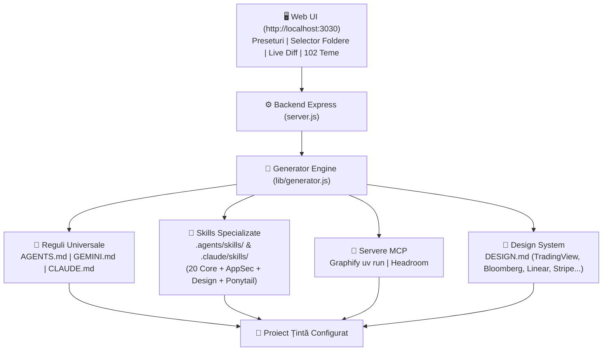

# 🛠️ AI Agent Project Configurator (Web & CLI)

> **Un ecosistem vizual și complet pentru configurarea profesională a proiectelor software cu Skills, Plugin-uri, Reguli de Arhitectură, Securitate și Servere MCP pentru agenți AI de codare ([Google Antigravity CLI `agy`](https://github.com/google/antigravity) și [Anthropic Claude Code CLI](https://claude.ai/code)).**

---

## 📑 Cuprins
1. [Prezentare Generală & Arhitectură](#-prezentare-generală--arhitectură)
2. [Pornire Rapidă](#-pornire-rapidă)
3. [Catalogul Complet al Skills-urilor](#-catalogul-complet-al-skills-urilor)
   - [A. Software Engineering & Arhitectură (20 Core & Senior Skills)](#a-software-engineering--arhitectură-20-core--senior-skills)
   - [B. Ponytail Suite – Lazy Senior Dev Mode](#b-ponytail-suite--lazy-senior-dev-mode)
   - [C. Graphify – AST Knowledge Graph & MCP Server](#c-graphify--ast-knowledge-graph--mcp-server)
   - [D. Headroom – Semantic Context & Token Compression](#d-headroom--semantic-context--token-compression)
   - [E. Cybersecurity & AppSec Suite (OWASP / MITRE)](#e-cybersecurity--appsec-suite-owasp--mitre)
   - [F. Frontend Design & Craft Suite](#f-frontend-design--craft-suite)
4. [Galerie Teme DESIGN.md (102 Teme Curate)](#-galerie-teme-designmd-102-teme-curate)
5. [Structura Fișierelor Generate în Proiectul Țintă](#-structura-fișierelor-generate-în-proiectul-țintă)
6. [Ghid API Backend (REST & SSE)](#-ghid-api-backend-rest--sse)
7. [Rulare pe VPS vs Rulare Locală](#-rulare-pe-vps-vs-rulare-locală)
8. [Contribuție & Licență](#-contribuție--licență)

---

## 🏗️ Prezentare Generală & Arhitectură

Dezvoltarea software asistată de agenți AI suferă adesea de:
* **Cod hiper-complicat și boilerplate excesiv** (agenții tind să instaleze biblioteci noi pentru probleme de 1 rând).
* **Consum gigantic de tokeni** la citirea oarbă a zeci de fișiere necunoscute.
* **Lipsa specificațiilor clare**, a testelor automate și a barierelor de securitate (OWASP).
* **Interfețe generice „AI slop”** (gradienturi violete clișeice, carduri în carduri, tipografie necalibrată).

**AI Agent Project Configurator** rezolvă aceste probleme injectând într-un proiect existent sau nou un set coerent și verificat de **reguli stricte, competențe specializate (skills) și instrumente MCP**.



---

## 🚀 Pornire Rapidă

### Prerechizite
- **Node.js**: v18.0.0 sau mai nou (recomandat Node v20/v22)
- **Python**: v3.10+ cu utilitarul `uv` (recomandat pentru serverul MCP Graphify)
- **Git**: instalat în sistem
- **CLI-uri suportate**: `agy` (Google Antigravity) și/sau `claude` (Claude Code)

### Instalare și Lansare
```bash
# Clonează depozitul
git clone https://github.com/mihaimurra001/preConfigProject.git
cd preConfigProject

# Instalează dependențele Node.js
npm install

# Pornește serverul Express
npm start
```

Deschide în browser:
👉 **[http://localhost:3030](http://localhost:3030)**

---

## 🧠 Catalogul Complet al Skills-urilor

Fiecare skill este o suită de instrucțiuni executabile stocate sub forma unui dosar ce conține fișierul de bază `SKILL.md` (cu metadate YAML și directive pas-cu-pas). Agenții le invocă automat sau la cererea utilizatorului prin comenzi rapide (`/slash`).

---

### A. Software Engineering & Arhitectură (20 Core & Senior Skills)

Bazate pe colecția de prestigiu **[addyosmani/agent-skills](https://github.com/addyosmani/agent-skills)** și extinse cu capabilități Pro Senior de nivel arhitectural:

| Skill ID | Comandă Slash | Categorie | Descriere & Când se Folosește |
| :--- | :---: | :---: | :--- |
| **`spec-driven-development`** | `/spec` | `define` | **Spec înainte de cod.** Forțează formularea clară a obiectivelor, ariei de acoperire (scope), non-goals, semnăturilor de interfață și a criteriilor de acceptare înainte de orice modificare de cod. |
| **`planning-and-task-breakdown`** | `/plan` | `plan` | **Descompunere atomică.** Sparge specificația în pași mici, verificabili și independenți, ordonați pe un graf strict de dependențe. |
| **`incremental-implementation`** | `/build` | `build` | **Construcție verticală felie-cu-felie.** Implementează un singur pas odată și rulează suita de teste la fiecare pas pentru a garanta zero regresii. |
| **`test-driven-development`** | `/test` | `verify` | **Ciclul strict Red-Green-Refactor.** Nicio linie de producție nu se scrie fără un test care să pice inițial; reproducerea oricărui bug printr-un test e obligatorie. |
| **`code-review-and-quality`** | `/review` | `review` | **Review obiectiv pe 5 axe:** Corectitudine, Arhitectură, Securitate, Performanță și Lizibilitate. Rulează înainte de orice commit sau PR. |
| **`code-simplification`** | `/code-simplify` | `review` | **Eliminare de complexitate cognitivă.** Identifică și șterge dead code, despachetează abstracțiuni inutile și aplatizează funcții încâlcite. |
| **`shipping-and-launch`** | `/ship` | `ship` | **Checklist de producție și release.** Verifică migrațiile, variabilele de mediu, documentația, politicile de rollback și smoke tests înainte de merge pe main. |
| **`debugging-and-error-recovery`** | `/debug` | `verify` | **Diagnosticare științifică a erorilor.** Folosește metoda bisection, analiza exactă a stack trace-urilor și izolarea reproductibilă a condițiilor de crash. |
| **`api-and-interface-design`** | `/api-design` | `define` | **Design de interfețe curate.** Asigură consistență REST/GraphQL, nomencatură idiomatică, tratarea erorilor standardizată și ergonomie maximă pentru consumatori. |
| **`performance-optimization`** | `/webperf` | `verify` | **Optimizare bazată pe măsurători.** Profilează blocajele CPU, alocările masive de memorie, interogările N+1 din baze de date și Core Web Vitals. |
| **`database-and-migrations-architect`** | `/db-architect` | `database` | **Arhitectură de baze de date zero-downtime.** Proiectează scheme relaționale sau NoSQL, scrie migrații sigure fără blocări de tabele (locks) și strategii optime de indexare. |
| **`root-cause-analysis-and-postmortem`** | `/rca` | `recovery` | **Metoda 5 Whys și Postmortem.** Sapă până la cauza de fond a unui incident, nu doar la simptom; redactează postmortem fără vină și scrie teste de regresie preventive. |
| **`api-contracts-and-backward-compat`** | `/api-contract` | `architecture` | **Protecție contracte API.** Garantează compatibilitatea retroactivă, versionare semantică, idempotency keys și previne spargerea clienților mobili sau externi. |
| **`concurrency-and-race-conditions`** | `/concurrency` | `architecture` | **Siguranță asincronă și fire de execuție.** Previne race conditions, double-spending, deadlock-uri și stări corupte la mutații paralele de memorie sau baze de date. |
| **`observability-and-structured-logging`** | `/observability` | `operations` | **Observabilitate modernă.** Implementează logging JSON structurat, corelare pe bază de Trace-ID, metrice Prometheus/OpenTelemetry și health-checks. |
| **`architecture-decision-records`** | `/adr` | `architecture` | **Documentarea deciziilor majore.** Înregistrează contextul, alternativele evaluate și consecințele alegerilor arhitecturale în dosarul `docs/adr/`. |
| **`accessibility-and-inclusive-design`** | `/a11y` | `frontend` | **Accesibilitate WCAG 2.1 AA/AAA.** Asigură navigarea completă din tastatură, contrastul de culoare, atributele ARIA semantice și compatibilitatea cu cititoarele de ecran. |
| **`refactoring-legacy-code`** | `/refactor-legacy` | `refactor` | **Modernizare sigură a codului vechi.** Folosește pattern-ul Strangler Fig și Characterization Tests pentru a curăța monolitul pas cu pas, fără riscuri. |
| **`interview-me`** | `/interview` | `define` | **Clarificare interactivă a cerințelor.** Când o cerință a utilizatorului este vagă, agentul oprește presupunerile și pune întrebări țintite, una câte una. |
| **`constraint-driven-development`** | `/constraints` | `architecture` | **Bariere clare de calitate.** Setează limite ferme de latență, dimensiune bundle, număr maxim de dependențe și bugete arhitecturale. |

---

### B. Ponytail Suite – Lazy Senior Dev Mode

Inspirat din proiectul **[DietrichGebert/ponytail](https://github.com/DietrichGebert/ponytail)** (rating 24k+ ⭐).  
Filosofia de bază: **„Cel mai bun cod este codul care nu a fost scris niciodată.”** Un developer senior leneș caută eficiența maximă, nu scurtăturile neglijente.

#### 🪜 Scara de Decizie Ponytail (se parcurge înainte de a scrie cod):
1. **Chiar trebuie construit asta? (YAGNI)** Dacă nu, nu scrie nimic.
2. **Există deja în codebase?** Reutilizează helperul existent; nu rescrie o copie.
3. **Rezolvă biblioteca standard (Standard Library) problema?** Folosește `node:crypto`, `fetch`, `node:fs` etc.
4. **Rezolvă platforma nativă problema?** Ex: `<input type="date">` în loc de flatpickr de 50KB.
5. **Rezolvă o dependență deja instalată problema?** Nu instala alta nouă.
6. **Poate fi scris într-o singură linie?** Scrie-l într-o singură linie.
7. **Doar dacă niciuna din cele de mai sus nu ține:** Scrie minimul absolut de cod funcțional.

#### 📦 Competențe Ponytail Incluse:
* **`ponytail` (`/ponytail`)**: Mod activ de programare ultra-minimalistă. Suportă 3 niveluri de intensitate: *Lite*, *Full* (standard) și *Ultra*.
* **`ponytail-review` (`/ponytail-review`)**: Code review critic care elimină abstracțiile premature, wrapper-ele inutile și bibliotecile adăugate fără justificare.
* **`ponytail-audit` (`/ponytail-audit`)**: Auditează fișierul `package.json` și propune înlocuirea dependențelor redundante cu funcții native din Node.js / JavaScript modern.
* **`ponytail-debt` (`/ponytail-debt`)**: Colectează toate comentariile `ponytail:` din fișiere într-un registru centralizat, prevenind transformarea scurtăturilor deliberate în datorie tehnică uitată.
* **`ponytail-gain` (`/ponytail-gain`)**: Afișează panoul de bord al economiei de cod (linii eliminate, viteză de execuție, costuri de tokeni reduse cu până la 54%).
* **`ponytail-help` (`/ponytail-help`)**: Cheat-sheet cu toate comenzile și scurtăturile Ponytail.

---

### C. Graphify – AST Knowledge Graph & MCP Server

Creat pe baza **[Graphify-Labs/graphify](https://github.com/Graphify-Labs/graphify)** (rating 31k+ ⭐).  
Transformă depozitul de cod, schemele SQL, fișierele de configurare și documentația Markdown într-un **graf de cunoștințe deterministic bazat pe arborele sintactic abstract (AST)**.

#### 🌟 De ce este esențial:
În loc ca agentul AI să citească la întâmplare 20-30 de fișiere pentru a înțelege cine apelează o funcție, el interoghează direct graful local `graphify-out/graph.json` prin protocolul **MCP (Model Context Protocol)**, realizând **economii de tokeni de până la 70x**.

#### 🛠️ Instrumente MCP Graphify disponibile agentului:
* `query_graph`: Interoghează relațiile arhitecturale din codebase.
* `get_node`: Inspectează definiția exactă a unei funcții, clase sau modul.
* `get_neighbors`: Arată toți apelanții (callers) și dependențele unui nod.
* `get_community`: Grupează logic modulele pe domenii funcționale.
* `god_nodes`: Identifică clasele sau fișierele monolit cu cuplaj excesiv.
* `graph_stats`: Statistici de complexitate și topologie a proiectului.
* `shortest_path`: Calculează cel mai scurt lanț de apeluri între două module distincte.
* `triage_prs` & `get_pr_impact`: Analizează impactul unui branch sau Pull Request asupra restului sistemului.

---

### D. Headroom – Semantic Context & Token Compression

Dezvoltat de **[headroomlabs-ai/headroom](https://github.com/headroomlabs-ai/headroom)** (rating 71.8k+ ⭐).  
Un motor avansat care compresează masiv datele bulky înainte ca acestea să umple context window-ul agentului:

* **SmartCrusher & CodeCompressor**: Compresează output-urile masive de teste unitare, log-urile de build și JSON-urile voluminoase păstrând intacte stack trace-urile, erorile critice și aserțiunile eșuate.
* **Economie Tokeni**: Reduce volumul de date transmise în context cu **20% până la 90%**.
* **Retrieve on Demand**: Dacă agentul are nevoie de detaliile la nivel de octet dintr-un bloc comprimat, le poate extrage la cerere prin `headroom_retrieve`.

---

### E. Cybersecurity & AppSec Suite (OWASP / MITRE)

Aliniat la standardele **Anthropic Cybersecurity & OWASP Top 10**:

* **`appsec-code-review` (`/security-audit`)**: Scanează codul împotriva vulnerabilităților critice: injecții SQL / NoSQL, Cross-Site Scripting (XSS), Server-Side Request Forgery (SSRF), IDOR / BOLA și validări lipsă la granița aplicației.
* **`threat-modeling` (`/threat-model`)**: Modelează amenințările cibernetice folosind matricea **STRIDE** (Spoofing, Tampering, Repudiation, Information Disclosure, Denial of Service, Elevation of Privilege).
* **`dependency-vulnerability-audit` (`/audit-deps`)**: Auditează `package-lock.json` sau `poetry.lock` împotriva bazei de date cu vulnerabilități cunoscute (CVE-uri) și pachete malițioase din lanțul de aprovizionare.
* **`secret-scanning` (`/scan-secrets`)**: Detectează tokeni privați, parole, chei SSH sau secrete de cloud lăsate accidental în cod, fișiere `.env` sau istoricul git.

---

### F. Frontend Design & Craft Suite

Suita completă pentru interfețe impecabile, respingând „AI Slop-ul” generic:

* **`design-taste-frontend` (`/taste`)**: Aplică **Cele Trei Dials**:
  - `DESIGN_VARIANCE` (1 - 10): Cât de îndrăzneț și neconvențional este layout-ul.
  - `MOTION_INTENSITY` (1 - 10): Cât de dinamice sunt tranzițiile și micro-interacțiunile.
  - `VISUAL_DENSITY` (1 - 10): Nivelul de compactare a informației pe ecran.
* **`impeccable` (`/impeccable`)**: 23 de comenzi de design craft (ierarhie vizuală, contrast strict, ritm vertical, tipografie proporțională).
* **`emil-design-eng` (`/emil-design`)**: Fizică și micro-interacțiuni după principiile lui Emil Kowalski (Linear / Vercel):
  - Fără `ease-in` la elementele care intră (doar decelerare `ease-out` cu `cubic-bezier(0.16, 1, 0.3, 1)`).
  - Micro-interacțiuni ultra-rapide sub 200ms.
  - Animații exclusiv pe proprietăți GPU (`transform` și `opacity`).
* **`animate` (`/animate`)**: Ghid de implementare pentru animații fluide la 60fps.

---

## 🎨 Galerie Teme DESIGN.md (102 Teme Curate)

Aplicația include o galerie cu **102 specificații complete de Design System**. La selectarea oricărei teme, este generat în rădăcina proiectului un fișier [`DESIGN.md`](file:///home/oem/proiecte/preConfigProject/DESIGN.md) ce conține paleta completă de culori, variabilele CSS `:root`, tipografia și principiile de identitate vizuală.

### Exemple de Teme Populare:

| Temă | ID | Categorie | Canvas | Accent | Punct Forte |
| :--- | :--- | :--- | :--- | :--- | :--- |
| **TradingView Pro** | `tradingview` | `dark fintech dev` | `#131722` | `#2962ff` | Lumânări japoneze `#26a69a` (Bull) / `#ef5350` (Bear), crosshairs, multi-panels, font monospace tabular. |
| **Binance Pro** | `binance` | `dark fintech` | `#0b0e11` | `#f0b90b` | Carnet de ordine live `#0ecb81` (Bid) / `#f6465d` (Ask), terminal crypto de mare viteză. |
| **Bloomberg Terminal** | `bloomberg` | `dark fintech editorial` | `#000000` | `#ff9900` | Monitor Wall Street cu chihlimbar fosforic, font monospace pur, colțuri 0px și densitate extremă. |
| **Linear** | `linear` | `dark dev` | `#010102` | `#5e6ad2` | Standardul absolut în SaaS developer tools: borduri hairline fine de 1px, lavandă discretă. |
| **Stripe** | `stripe` | `light fintech` | `#f8f9fa` | `#635bff` | Încredere financiară, indigo vibrant, umbre stratificate matematice pe 2 nivele. |
| **Vercel** | `vercel` | `dark dev` | `#000000` | `#0070f3` | Contrast înalt alb/negru, geometrie strictă, albastru electric. |
| **Apple HIG** | `apple` | `light/dark` | `#ffffff` | `#0071e3` | Blurring translucid (`backdrop-filter`), font SF Pro, interfețe human-centered. |
| **Supabase** | `supabase` | `dark dev` | `#1c1c1c` | `#3ecf8e` | Verde smarald vibrant pe negru cărbune, estetică de bază de date modernă. |
| **Tailwind CSS** | `tailwind` | `light dev` | `#ffffff` | `#0ea5e9` | Paletă slate/sky echilibrată, spațiere modulară la 4px. |
| **Porsche** | `porsche` | `dark luxury` | `#0c0c0c` | `#d5001c` | Roșu carmin de curse, tipografie solemnă, eleganță mecanică. |
| **Leica** | `leica` | `light luxury` | `#f5f5f5` | `#e2001a` | Punctul roșu emblematic de cameră fotografică de colecție pe textură curată. |

---

## 📁 Structura Fișierelor Generate în Proiectul Țintă

La apăsarea butonului **„Aplică în Proiect”**, configuratorul creează următoarea structură standardizată:

```text
proiect-tinta/
├── AGENTS.md                  # Reguli universale cross-agent (Antigravity, Claude, Cursor, Codex)
├── GEMINI.md                  # Reguli automate la startup pentru Google Antigravity CLI (agy)
├── CLAUDE.md                  # Instrucțiuni și convenții de mediu pentru Claude Code CLI
├── DESIGN.md                  # Specificația completă de design system (culori, fonturi, CSS :root)
├── setup-ai-environment.sh    # Script executabil automat pentru instalarea pachetelor și a MCP
│
├── .agents/                   # Directoriu nativ Google Antigravity
│   ├── rules/
│   │   ├── ponytail.md        # Regula de cod leneș și eficient (YAGNI, stdlib)
│   │   ├── security.md        # Politici de securitate OWASP / MITRE
│   │   ├── headroom.md        # Directiva de compresie de tokeni
│   │   └── graphify.md        # Instrucțiuni de interogare a grafului de cod
│   ├── skills/                # 20+ Skills instalate nativ
│   │   ├── spec-driven-development/SKILL.md
│   │   ├── test-driven-development/SKILL.md
│   │   ├── code-review-and-quality/SKILL.md
│   │   ├── database-and-migrations-architect/SKILL.md
│   │   ├── appsec-code-review/SKILL.md
│   │   ├── design-taste-frontend/SKILL.md
│   │   └── ...
│   ├── workflows/
│   │   └── graphify.md        # Workflow de re-indexare periodică a grafului
│   └── mcp_config.json        # Configurație servere MCP (Graphify, etc.)
│
└── .claude/                   # Directoriu nativ Claude Code CLI
    ├── settings.json          # Servere MCP și setări de permisiuni automate
    └── skills/                # Skills sincronizate pentru Claude Code
        └── ...
```

---

## 🔌 Ghid API Backend (REST & SSE)

Serverul Node.js (`server.js`) rulează pe portul `3030` și expune:

| Metodă | Endpoint | Descriere |
| :--- | :--- | :--- |
| `GET` | `/api/environment` | Detectează versiunile binarelor din sistem (`node`, `python3`, `uv`, `git`, `agy`, `claude`). |
| `GET` | `/api/skills-catalog` | Returnează lista completă de skills, reguli, preseturi și cele 102 teme. |
| `POST` | `/api/browse-fs` | Răsfoiește folderele locale ale mașinii gazdă pentru selecție vizuală rapidă. |
| `POST` | `/api/inspect-path` | Verifică un folder țintă (dacă conține `package.json`, `.git`, fișiere de agenți). |
| `POST` | `/api/preview` | Generează structura virtuală a fișierelor și conținutul lor exact înainte de scriere. |
| `POST` | `/api/apply` | Scrie fizic pe disc fișierele de configurare în folderul proiectului selectat. |
| `GET` | `/api/saved-projects` | Listează proiectele favorite/salvate anterior. |
| `POST` | `/api/saved-projects` | Salvează un proiect nou în lista de acces rapid. |
| `DELETE`| `/api/saved-projects/:id` | Șterge un proiect din lista salvată. |
| `GET` | `/api/stream-command` | Flux **Server-Sent Events (SSE)** pentru rularea și afișarea în consolă a comenzilor de terminal în timp real (`pip install`, `setup-ai-environment.sh`). |

---

## 🌐 Rulare pe VPS vs Rulare Locală

* **Când rulezi local (`http://localhost:3030`)**:  
  Aplicația accesează direct discul laptopului tău, navighează prin folderele tale și aplică modificările instantaneu. Aceasta este cea mai comodă metodă pentru dezvoltarea pe mașina locală.
* **Când găzduiești pe un VPS (`http://vps-ip:3030`)**:  
  Backend-ul scrie fișierele pe discul VPS-ului. Este ideal dacă dezvolți de la distanță prin **SSH**, **VS Code Remote** sau rulezi agenți AI în sesiuni `tmux` direct pe server.

---

## 📄 Contribuție & Licență

Proiectul este open-source sub licența **MIT**.  
Contribuțiile prin Pull Requests, teme noi sau skills avansate sunt binevenite!

* Creat cu pasiune pentru comunitatea de ingineri software și agenți AI autonomi. 🚀
